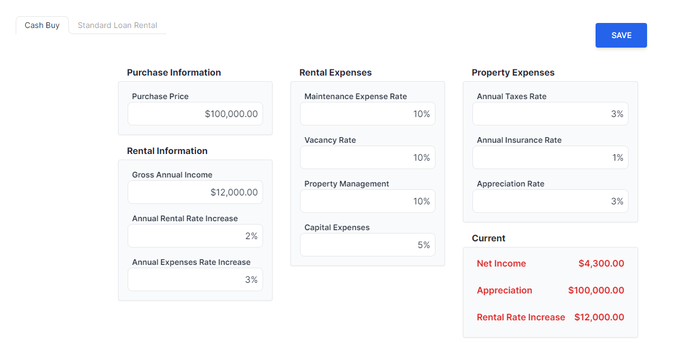

This is a [Next.js](https://nextjs.org/) project bootstrapped with [`create-next-app`](https://github.com/vercel/next.js/tree/canary/packages/create-next-app).

AWS Link: http://54.165.250.219/




## Getting Started

First, run the development server:

```bash
npm run dev
# or
yarn dev
# or
pnpm dev
```

Open [http://localhost:3000](http://localhost:3000) with your browser to see the result.

You can start editing the page by modifying `app/page.tsx`. The page auto-updates as you edit the file.

This project uses [`next/font`](https://nextjs.org/docs/basic-features/font-optimization) to automatically optimize and load Inter, a custom Google Font.

## Learn More

To learn more about Next.js, take a look at the following resources:

- [Next.js Documentation](https://nextjs.org/docs) - learn about Next.js features and API.
- [Learn Next.js](https://nextjs.org/learn) - an interactive Next.js tutorial.

You can check out [the Next.js GitHub repository](https://github.com/vercel/next.js/) - your feedback and contributions are welcome!

## Deploy on Vercel

The easiest way to deploy your Next.js app is to use the [Vercel Platform](https://vercel.com/new?utm_medium=default-template&filter=next.js&utm_source=create-next-app&utm_campaign=create-next-app-readme) from the creators of Next.js.

Check out our [Next.js deployment documentation](https://nextjs.org/docs/deployment) for more details.

## Calculations for Real Estate

Refer to <https://www.calculator.net/rental-property-calculator.html>

1. Net Income
2. Appreciation
3. Future Rental Income

```Javascript
const calculateNetOperatingIncome = (
  monthlyRent: number,
  annualIncreaseMonthlyRent: number,
  vacancyRate: number,
  managementFee: number,
  otherMonthlyIncome: number,
  annualIncreaseOtherMonthlyIncome: number,
  holdingLength: number
) => {
  const yearsRent = Array.from(
    { length: holdingLength },
    (_, year) => monthlyRent * Math.pow(1 + annualIncreaseMonthlyRent / 100, year)
  )
  const rentalIncome =
    yearsRent.reduce((acc, yr) => acc + yr * 12, 0) *
    (1 - vacancyRate / 100) *
    (1 - managementFee / 100)

  const yearsOtherIncome = Array.from(
    { length: holdingLength },
    (_, year) => otherMonthlyIncome * Math.pow(1 + annualIncreaseOtherMonthlyIncome / 100, year)
  )
  const otherIncome = yearsOtherIncome.reduce((acc, yr) => acc + yr * 12, 0)
  return rentalIncome + otherIncome
}
const calculateFinancialInvestment = ({
  purchase_price,
  use_loan,
  down_payment,
  interest_rate,
  loan_term,
  closing_cost,
  need_repairs,
  repair_cost,
  value_after_repairs,

  // Income
  monthly_rent,
  annual_increase_monthly_rent,
  other_monthly_income,
  annual_increase_other_monthly_income,
  vacancy_rate,
  management_fee,

  // Recurring Operating Expenses
  property_tax,
  annual_increase_property_tax,
  total_insurance,
  annual_increase_total_insurance,
  hoa_fee,
  annual_increase_hoa_fee,
  maintenance,
  annual_increase_maintenance,
  other_costs,
  annual_increase_other_costs,

  // Sell
  know_sell_price,
  sell_price,
  value_appreciation,
  holding_length = 1,
  cost_to_sell
}: TFinancialReportValues): TScenarioCalculations => {
  // Calculate loan amount if using a loan
  const loanAmount = use_loan ? purchase_price * (1 - down_payment / 100) : 0

  // Calculate total mortgage payment if using a loan
  const totalMortgagePayment = (() => {
    if (!use_loan) return 0

    const monthlyInterestRate = interest_rate / 1200
    const numberOfPayments = loan_term * 12
    const monthlyMortgagePayment =
      (loanAmount * (monthlyInterestRate * Math.pow(1 + monthlyInterestRate, numberOfPayments))) /
      (Math.pow(1 + monthlyInterestRate, numberOfPayments) - 1)

    return monthlyMortgagePayment * 12 * holding_length
  })()

  const totalIncome = calculateNetOperatingIncome(
    monthly_rent,
    annual_increase_monthly_rent,
    vacancy_rate,
    management_fee,
    other_monthly_income,
    annual_increase_other_monthly_income,
    holding_length
  )

  // Recurring operating expenses
  const propertyTaxExpense =
    (property_tax * (1 - Math.pow(1 + annual_increase_property_tax / 100, holding_length))) /
    (1 - (1 + annual_increase_property_tax / 100))
  const insuranceExpense =
    (total_insurance * (1 - Math.pow(1 + annual_increase_total_insurance / 100, holding_length))) /
    (1 - (1 + annual_increase_total_insurance / 100))
  const hoaExpense =
    (hoa_fee * (1 - Math.pow(1 + annual_increase_hoa_fee / 100, holding_length))) /
    (1 - (1 + annual_increase_hoa_fee))
  const maintenanceExpense =
    (maintenance * (1 - Math.pow(1 + annual_increase_maintenance / 100, holding_length))) /
    (1 - (1 + annual_increase_maintenance / 100))
  const otherExpense =
    (other_costs * (1 - Math.pow(1 + annual_increase_other_costs / 100, holding_length))) /
    (1 - (1 + annual_increase_other_costs / 100))

  const totalExpenses =
    propertyTaxExpense + insuranceExpense + hoaExpense + maintenanceExpense + otherExpense
  const netIncome = totalIncome - totalMortgagePayment - totalExpenses

  const totalPurchaseCost = purchase_price + closing_cost + (need_repairs ? repair_cost : 0)
  const effectiveValueAfterRepairs = need_repairs ? value_after_repairs : purchase_price

  const propertyValue =
    (know_sell_price
      ? sell_price
      : effectiveValueAfterRepairs * Math.pow(1 + value_appreciation / 100, holding_length)) *
    (1 - cost_to_sell / 100)

  const appreciation = propertyValue - totalPurchaseCost
  const rentalRateIncrease =
    totalIncome *
    ((Math.pow(1 + annual_increase_monthly_rent / 100, holding_length) - 1) / holding_length)
  return {
    netIncome,
    appreciation,
    rentalRateIncrease
  }
}
```
